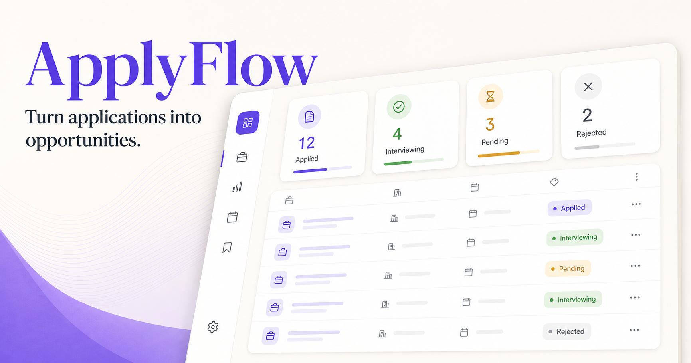

# ApplyFlow

[](https://app.netlify.com/projects/applyflow-career-tracker/deploys)
[](https://github.com/shah-hadi/applyflow/actions/workflows/ci.yml)

A private, full-stack job application tracker for organizing opportunities, follow-ups, interviews, and offers in one focused workspace.

**[View the live app](https://applyflow-career-tracker.netlify.app)**



## Highlights

- Secure email and password authentication with Supabase Auth
- Per-user application data protected by PostgreSQL row-level security
- Application pipeline with stages, priorities, notes, contacts, and dates
- Search, filters, sorting, activity history, and dashboard metrics
- Follow-up planning and interview preparation workflows
- CSV import and export for data portability
- Responsive interface designed for desktop and mobile
- Production deployment on Netlify

## Tech stack

- Next.js 16, React 19, and TypeScript
- Supabase Auth and PostgreSQL
- Netlify Next.js runtime
- ESLint and Node's built-in test runner

## Local setup

Requirements: Node.js 22 or newer and a Supabase project.

```bash
git clone https://github.com/shah-hadi/applyflow.git
cd applyflow
npm ci
cp .env.example .env.local
npm run dev
```

Set these values in `.env.local`:

```dotenv
NEXT_PUBLIC_SUPABASE_URL=https://your-project.supabase.co
NEXT_PUBLIC_SUPABASE_PUBLISHABLE_KEY=sb_publishable_your_key
NEXT_PUBLIC_SITE_URL=http://localhost:3000
```

Open [http://localhost:3000](http://localhost:3000).

Only the Supabase publishable key belongs in the browser application. Never expose a secret or service-role key.

## Available commands

| Command | Purpose |
| --- | --- |
| `npm run dev` | Start the local development server |
| `npm run build` | Create an optimized production build |
| `npm run start` | Run the production server locally |
| `npm run lint` | Check code quality |
| `npm test` | Build and run workflow tests |

## Deployment

The repository includes `netlify.toml`. To deploy your own copy:

1. Import this repository into Netlify.
2. Add the three variables from `.env.example` in Netlify's environment settings.
3. Set `NEXT_PUBLIC_SITE_URL` to your production URL.
4. Add the same production URL to the allowed redirect URLs in Supabase Auth.
5. Deploy the `main` branch.

## Project documentation

- [Architecture](docs/ARCHITECTURE.md) — authentication, data ownership, application state, and deployment
- [Contributing](CONTRIBUTING.md) — development workflow and pull-request expectations
- [Security policy](SECURITY.md) — security model and responsible disclosure

## Security model

The frontend uses a Supabase publishable key. PostgreSQL row-level security restricts reads and writes to rows owned by the authenticated user. Authentication sessions are managed by Supabase, and private database credentials are not included in this repository.

## License

Released under the [MIT License](LICENSE).
